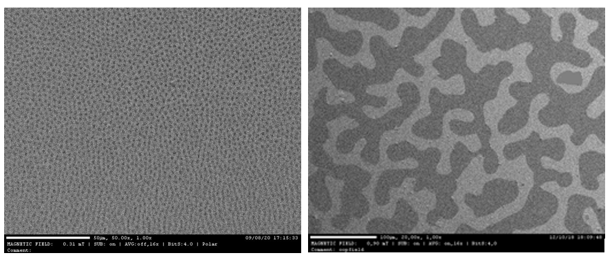
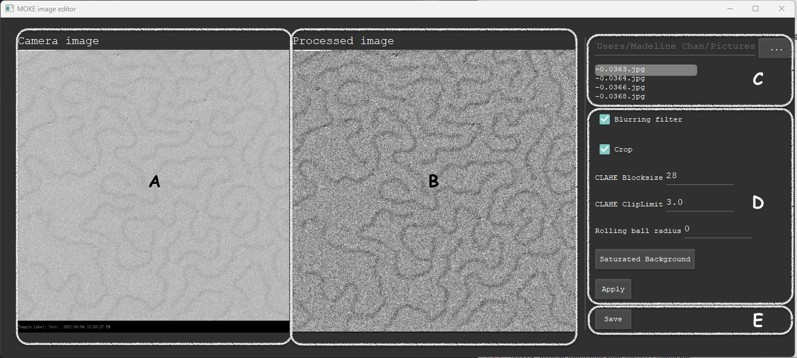
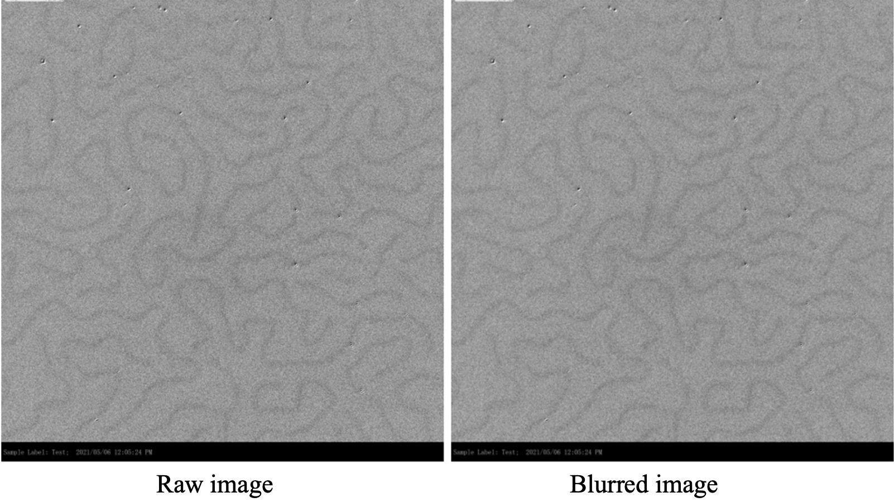
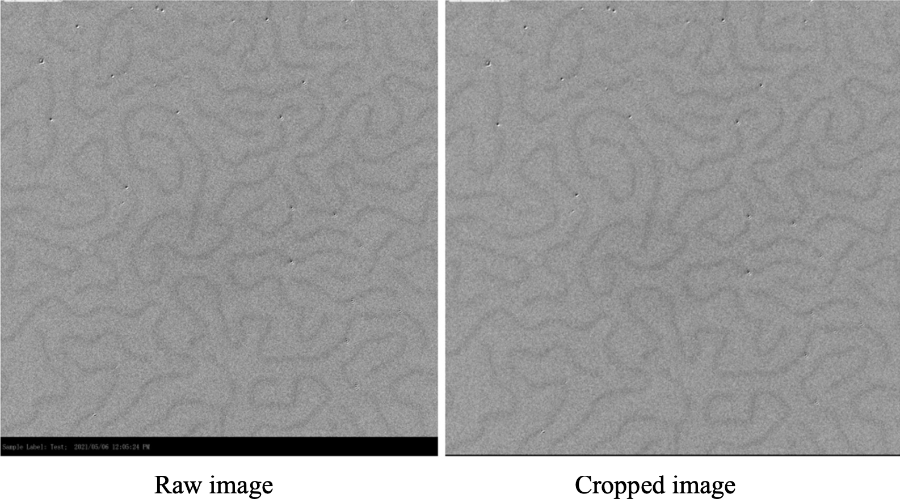
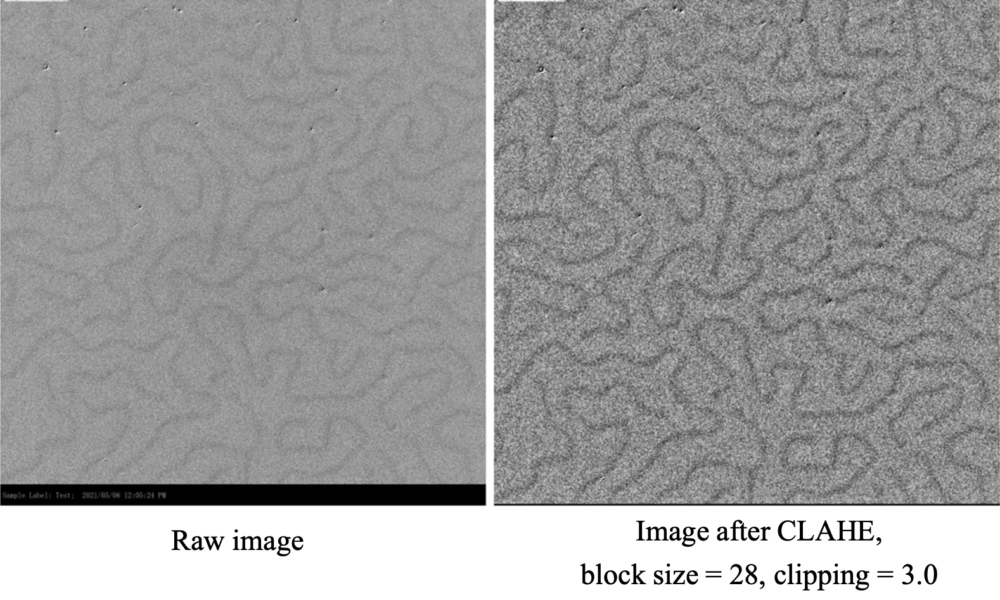
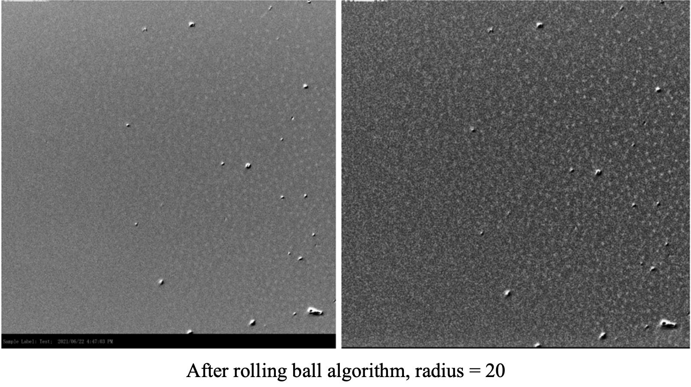
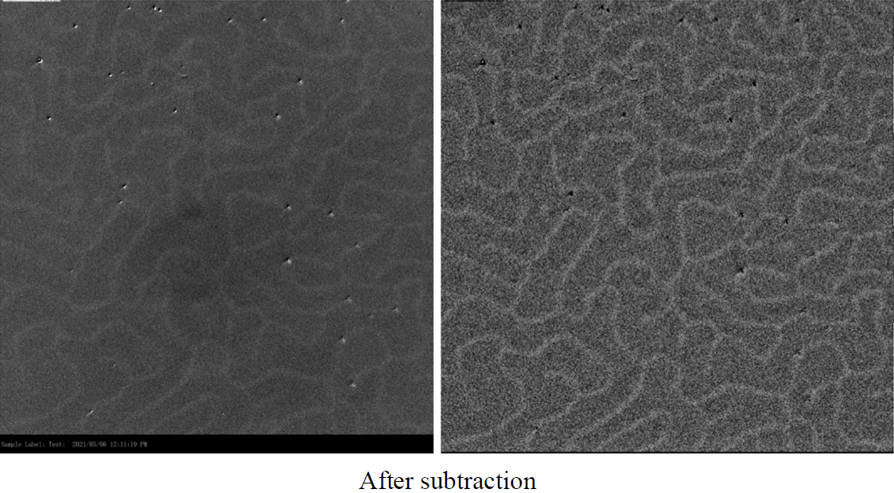
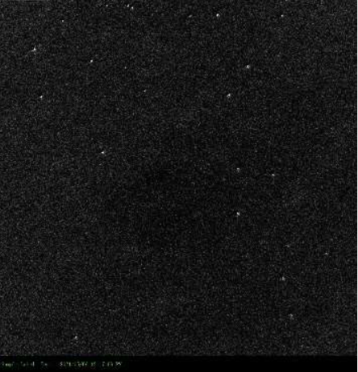

# Image Editor for MOKE (Magneto-optic Kerr effect) images

## Background of MOKE (Magneto-optic Kerr effect) images
MOKE (Magneto-optic Kerr effect) images depict alterations in the light reflected from a magnetized surface. These images play a crucial role in material science research, enabling the investigation of the magnetic microstructure of various materials.

This is how a typical MOKE image will look like.  

Therefore, it is important to have a clear MOKE image to visualize mesoscopic elements, such as magnetic domains, labyrinth patterns and skyrmions. However, images collected from Kerr Microscope might not be high quality enough sometimes. Further operations have to be applied to enhance the observable Kerr effect features. This application is implemented to improve the clarity and details of the Kerr microscopy images, enabling effcient study of magneto-optic kerr effect.

## User Interface for MOKE image processing

### Interface introduction

- A: raw input image, video
- B: processed image, video 
- C: File directory
- D: image operations
    - Smoothing filter (3x3 averaging)
    - Crop image (remove the black label underneath)
    - CLAHE specification (block size and clip limit)
    - Rolling ball radius
    - Saturated background subtraction
- E: saving

## Improving Clearity and enhance detials with Computer Vision operations

### 1. Denoise and Grain removal
A smoothing filter is used to denoise and remove grain. When a suitable smoothing filter is applied, it can remove high frequency noise from the image without blurring the important features in the image. Averaging filter will be a suitable filter in this case. 

### 2. Cropping 
This cropping operation is specified for removing the black label. The raw image size is 2138:2048. Size after cropping is 2054:2048.

### 3. CLAHE (Contrasted limited adaptive histogram equalization)
It is an operation to improve contrast in images. It originates from histogram equalization. Histogram equalization is a method that evenly distribute the intensity on full range. CLAHE is different from normal histogram equalization in two ways. It is an adaptive approach that it computes several histograms, each corresponding to a distinct section of the image. Therefore, it can improve the local contrast. However, it will overamplify noise in relatively homogeneous region. Therefore, clipping value is needed to control the contrast enhancement. users must use suitable block size and clipping value to achieve a nicely processed image. Block size of 28 and clipping value of 3.0 is recommended.

### 4. Rolling ball algorithm
It is a method to correct for uneven illuminated background. It is useful to process image that includes skyrmion that it can distinguish the skyrmion from the background, making the skyrmion seemingly more outstanding. There is usually third dimension (surface height) for a 2D grayscale image which is intensity. The algorithm is intuitive. To get the intensity of the background, image submerging sphere under the surface at the desired position. Once it is completely covered by the blocks, the ball determines the intensity of the background at the position. Then we can roll this ball around below the surface to get the background values for the entire image. Therefore, the radius of the rolling ball should fit the size of the skyrmion.

### 5. Saturated state subtraction
It is observed that there is some common shadow or noise appears in the same series of images. A way to remove these untruth signals is to subtract the image from the saturated state, which is usually the darkest image. The background intensity is usually shifting with different magnetic field strength. The subtraction also unifies the background intensity.
 
Image that used as saturated background:  

